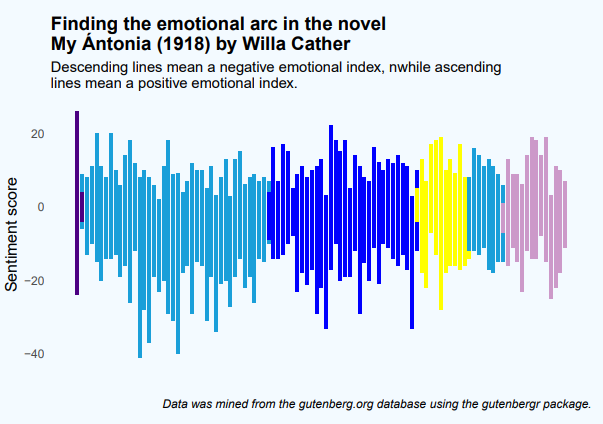

# Text and sentiment analysis of the novel My Ántonia (1918) by Willa Cather

The novel follows the recollections of Jim Burden who goes to live with his grandparents in Nebraska after his parents die. This novel takes place during The Great Migration. As a child Jim Burden meets and befriends Bohemian immigrant Ántonia Shimerda who becomes a symbol for live on the prairie.

## Analysis
Using the *gutenbergr* package I imported the novel from the gutenberg.org database. With the *tidytext* package I performed a sentiment analysis. 

## File storage
All files pertaining to this analysis are stored using the Guerilla Method.
+ **The PDF file:**
 Contains all code used for this analysis and its relation to the novel. This file was written for my professor who introduced me to the novel and isn't familiar with R. Therefore it contains explanations that might be construed as elaborate by anyone familiar with R.
+ **The R script my_antonia.R**:
Contains only the code used for this analysis.

## References
All sources used for this analysis are noted in the *references.bib* file.

## Reproducibility and License
This was a fun way to practice sentiment analysis with R. It is always my intention to make code as reproducible as possible.
If you would like to use any of the graphs or code that is fine, just let me know or reference me when you do!
